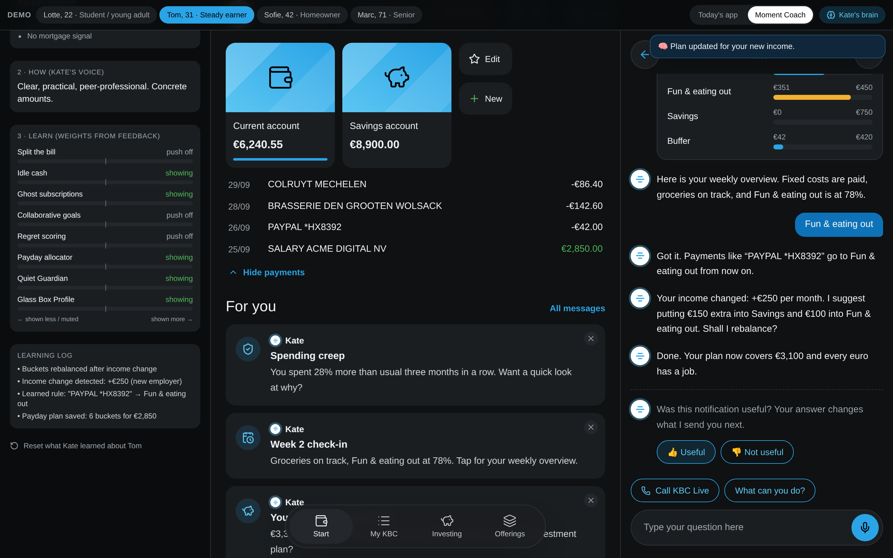
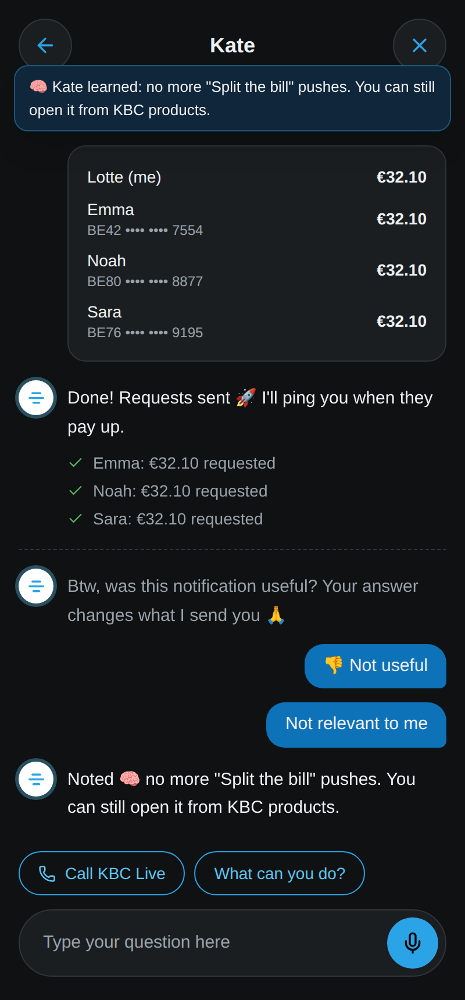
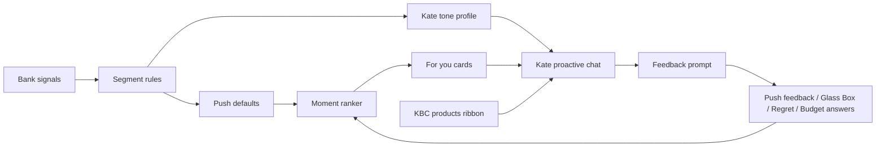

# KBC Moment Coach

**Tectonic Hackathon: KBC case.** A proof of concept for a new way KBC understands, supports and guides its customers.

Today, Kate mostly waits for questions, and the tips on the Start screen are the same for everyone ("High energy prices? …"). **Moment Coach makes Kate proactive and personal.** She notices *moments* in your transactions, reaches out in **For you**, talks the way *you* like, and asks "was this useful?" so every customer ends up as a *segment of one*.

> **Segments set the default pushes and Kate's voice. Your feedback trains what KBC sends next.**

All data is fictional and mocked. There are no real bank APIs, no real payments and no AI calls.

| Payday allocator + Kate's brain (desktop) | Split the bill + feedback loop (mobile) |
| --- | --- |
|  |  |

More in [`docs/screenshots`](docs/screenshots).

---

## Run it

Requires Node.js 20+.

```bash
npm install
npm run dev        # http://localhost:3000
# production build
npm run build && npm start
```

## Demo in 3 minutes

The dark bar at the top holds the **demo controls** (not part of the product):

| Control | What it does |
| --- | --- |
| Persona buttons | Switch between 4 fictional customers (one per segment) |
| **Today's app / Moment Coach** | Before/after: generic Kate tips vs personal moments |
| **Kate's brain** | Live "segment of one" panel: segment + reasons, Kate's voice, learned weights per moment, learning log |

Suggested script:

1. **Today's app** → generic tips for everyone. Switch to **Moment Coach**.
2. **Lotte (student)**: For you shows *Big night out?*, betting check-in, subscriptions, goals, *Worth it?*. Kate is casual.
3. Open **Split the bill** → *Use demo receipt* → tap who had what → *Send payment requests*.
4. Answer the feedback question with **👎 → Not relevant to me** → the Split push disappears and the brain panel shows the weight drop.
5. Open **Worth it?**, rate 2–3 payments 👎 → the card changes to a learned *Friday heads-up*.
6. Open **Is this you? 👀** (Glass Box) → *I just started my first job* → Lotte moves to "Steady earner": Payday appears and the tone changes.
7. **Marc (senior)**: *Payment on hold* scam check. Calm tone, double confirmations.
8. **Tom / Sofie**: **Payday allocator** (buckets, weekly overview, "which bucket?" rule learning, simulated salary change → rebalance) and **Idle cash** with different framing for a renter vs a homeowner.
9. **Offerings → Moments by Kate**: every moment is open to everyone. Pushes depend on profile + feedback, and you can turn a push on from there.

## The personalization model (3 layers)

| Layer | What it decides | Where in code |
| --- | --- | --- |
| **1. Who**: segment defaults | Which pushes are on by default (Student/young adult, Steady earner, Homeowner, Senior) | `src/lib/segment.ts`, `defaults` in `src/lib/moments.ts` |
| **2. How**: Kate's tone | Same moment, different words, product framing and confirmations per segment | `src/lib/tone.ts` (`say()`), copy in every flow |
| **3. Learn**: explicit feedback | 👍/👎 + reason, dismiss reasons, Glass Box corrections, regret ratings, bill-category answers → per-moment weights, flags, segment override | `src/lib/engine.ts` (`applyFeedback`, `rank`) |

Ranking: `score = base priority + trigger urgency + learned weight`. A weight of ≤ −1 mutes the push. The feature is still reachable from KBC products.

### Default push matrix

| Moment | Student/YA | Steady | Homeowner | Senior |
| --- | :-: | :-: | :-: | :-: |
| Split the bill | on | – | – | – |
| Idle cash | – | on | on | – |
| Ghost subscriptions | on | on | on | on |
| Collaborative goals | on | – | – | – |
| Regret scoring | on | – | – | – |
| Payday allocator | – | on | on | – |
| Quiet Guardian | **on** ¹ | on | on | on |
| Glass Box Profile | on | on | on | on |

¹ Changed from the original brief: young adults are a key risk group for gambling and running out of money.

### Signals (mocked here, available to a bank today)

| Moment | Signal |
| --- | --- |
| Split the bill | Restaurant payment > €60, friends paying back afterwards |
| Idle cash | Balance > 1.5× monthly spending for 60+ days |
| Ghost subscriptions | Recurring merchants, price increases, duplicates, trials turned paid |
| Collaborative goals | Labelled savings transfers, money exchanged within a group |
| Regret scoring | Discretionary payments in the last 7 days |
| Payday allocator | Salary credit, employer or amount change, uncategorised payments |
| Quiet Guardian | Betting trend, spending creep, late/missing salary, new payee + urgency (scam) |
| Glass Box | All of the above, shown to the customer with confidence and "why we think this" |

**New signals this adds:** explicit customer feedback on every push, confirmations/corrections of what KBC infers, "worth it?" ratings and bill-category answers. These are consented signals that are far stronger than inference.

## Why it scales to 2.3M customers

- **Moments are plug-ins.** One config object in `src/lib/moments.ts` holds the trigger, default segments, tone-aware copy and icon. Adding a 9th moment means adding one entry; the For you ranking, feedback loop, brain panel and Offerings grid pick it up automatically.
- **The heavy lifting is cheap.** Triggers and ranking are rules + weights over transaction events, so they batch or stream easily. A language model would only be needed for the final wording, and in this version even that is scripted.
- **Same channels KBC already has.** For you cards, Kate chat, notifications. No new app.

## Architecture



```
src/
  app/                 Next.js App Router entry (single page, static)
  lib/
    types.ts           Domain types
    personas.ts        4 fictional customers (transactions, beliefs, contacts)
    segment.ts         Layer 1: segment rules (+ customer override)
    tone.ts            Layer 2: say(segment, variants)
    moments.ts         Moment plug-in registry (triggers, defaults, card copy)
    engine.ts          Layer 3: ranking + feedback → weights
    store.tsx          Client state, validated localStorage persistence
    iban.ts, format.ts Helpers (Belgian IBAN mod-97 check, € formatting)
  components/
    App.tsx            Shell, demo bar, bell, bottom nav, layout
    StartScreen.tsx    Start + For you cards (dismiss with reason)
    OfferingsScreen.tsx KBC products + "Moments by Kate" grid
    KateChat.tsx       Kate chat, scripted intent router, flows
    FeedbackPrompt.tsx "Was this useful?" loop
    BrainPanel.tsx     Segment-of-one panel
    flows/             One file per moment (Split + Payday are the deep flows)
```

## Security notes (for the Aikido audit)

- **No backend, no API routes, no secrets.** The app is fully static with mocked data, so there are no server endpoints to abuse and no IDs to manipulate (no IDOR surface). Persona switching is a demo control held in client state, not a URL parameter.
- **Strict security headers** in `next.config.ts`: CSP (`default-src 'self'`, `object-src 'none'`, `frame-ancestors 'none'`), HSTS, `X-Frame-Options: DENY`, `nosniff`, Referrer-Policy, Permissions-Policy. `X-Powered-By` is disabled.
- **Untrusted input is validated:** IBANs (format + mod-97), names and bucket names (allow-list characters, length limits), amounts (clamped). Receipt uploads are checked for type and size (≤ 5 MB) and are never read or uploaded; extraction is mocked.
- **localStorage is treated as untrusted:** everything read back is size-limited, type-checked and whitelisted (`sanitizeLearn` in `store.tsx`).
- No `dangerouslySetInnerHTML` and no `eval`. React escapes all rendered text.
- Dependencies: Next.js 16.3.8 / React 19; `npm audit` reports 0 vulnerabilities at the time of writing.

## Not in this version / next steps

- **Kate's replies are scripted** (per segment). Free text is routed by keywords to a moment. The next step is an LLM (e.g. Gemini on Google Cloud) for the final wording, via a server route with the key in environment variables.
- Receipt OCR, real payment requests, real notifications and bank APIs are mocked.
- No authentication (single-user demo). A real deployment sits behind KBC's existing login.
- Learning is stored per browser in localStorage. In production this would be a per-customer preference store.
- Voice (ElevenLabs) for a spoken proactive nudge is a stretch goal.
- Dutch/French language toggle.

Built during the Tectonic Hackathon.
